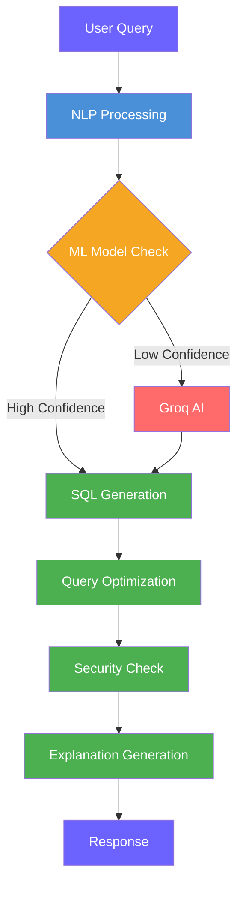

# GenialQuery - AI-Powered Text-to-SQL

**Convert natural language to optimized SQL queries using NLP + Machine Learning + Groq AI**

---

##  Features

-  **Text-to-SQL**: Convert natural language to SQL queries
-  **ML Model**: Trained on 1,205 examples with Random Forest
-  **Groq AI**: Advanced LLM for complex queries (Mixtral/LLaMA)
-  **Dynamic Schema**: Auto-discovers tables from CSV files
-  **Guest Mode**: Use without registration
  
---

## 🛠️ Technology Stack

| Component | Technology |
|-----------|------------|
| **Backend** | Flask 2.3.2 |
| **ML Model** | scikit-learn (Random Forest) |
| **AI/LLM** | Groq API (Llama 3.3) |
| **NLP** | Custom regex + keyword matching |
| **Data Processing** | pandas |
| **Authentication** | Flask-JWT-Extended |
| **Frontend** | HTML5, CSS3, Vanilla JS |

---
## 🔄 Query Processing Pipeline

---
